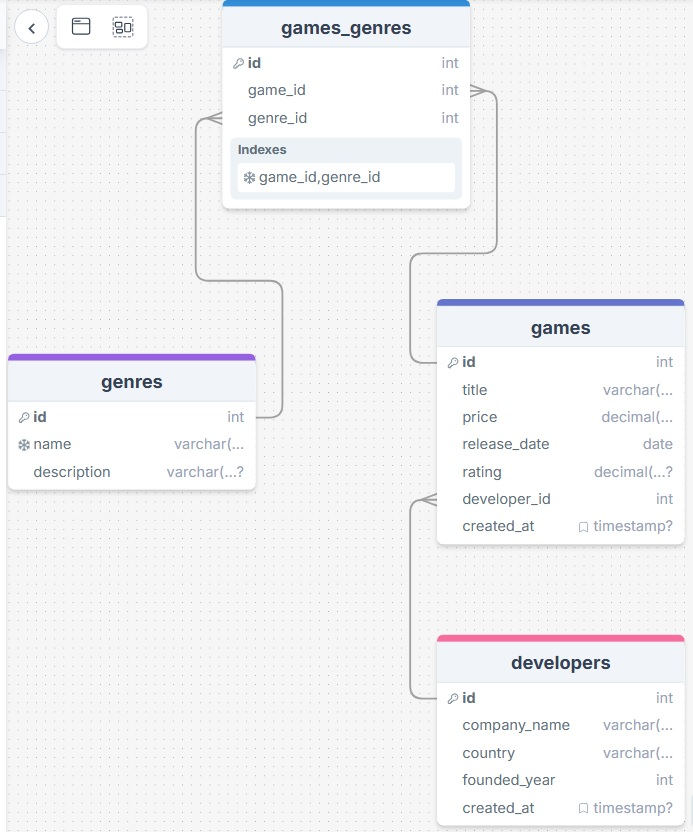

# GameVault Database

Dijital oyun dağıtım platformu için veritabanı tasarımı (Örn. Steam)



Schema link: https://drawsql.app/teams/-6327/diagrams/gamevault-database

## ✓ Tamamlanan Görevler

- **DDL:** 4 tablo oluşturuldu (developers, games, genres, games_genres)
- **FK/İlişkiler:** 1-to-Many ve Many-to-Many tanımlandı (CASCADE)
- **DML:** 5 geliştirici, 5 tür, 10 oyun, 18 ilişki eklendi
- **UPDATE/DELETE:** %10 indirim, puan güncelleme, Fallout 4 silindi
- **SELECT/JOIN:** Tüm oyunlar, RPG filtresi, 500+ fiyat analizi, "War" araması

## Tablo Özeti

- `developers`: id (SERIAL, PK), company_name, country, founded_year
- `games`: id (SERIAL, PK), title, price, release_date, rating, developer_id (FK)
- `genres`: id (SERIAL, PK), name (UNIQUE), description
- `games_genres`: id (SERIAL, PK), game_id (FK), genre_id (FK), UNIQUE (game_id, genre_id)

## CREATE Komutları (DDL - Data Definition Language)

Veritabanı tabloları oluşturma komutları:

```sql
-- Geliştiriciler Tablosu Oluşturma
CREATE TABLE developers (
    id SERIAL PRIMARY KEY,
    company_name VARCHAR(100) NOT NULL,
    country VARCHAR(50) NOT NULL,
    founded_year INT NOT NULL,
    created_at TIMESTAMP DEFAULT CURRENT_TIMESTAMP
);

-- Oyun Türleri Tablosu Oluşturma
CREATE TABLE genres (
    id SERIAL PRIMARY KEY,
    name VARCHAR(50) NOT NULL UNIQUE,
    description VARCHAR(255)
);

-- Oyunlar Tablosu Oluşturma
CREATE TABLE games (
    id SERIAL PRIMARY KEY,
    title VARCHAR(150) NOT NULL,
    price DECIMAL(10, 2) NOT NULL,
    release_date DATE NOT NULL,
    rating DECIMAL(3, 1) CHECK (rating >= 0 AND rating <= 10),
    developer_id INT NOT NULL,
    created_at TIMESTAMP DEFAULT CURRENT_TIMESTAMP,
    FOREIGN KEY (developer_id) REFERENCES developers(id) ON DELETE CASCADE ON UPDATE CASCADE
);

-- Oyun-Tür İlişkisi Tablosu Oluşturma (Many-to-Many)
CREATE TABLE games_genres (
    id SERIAL PRIMARY KEY,
    game_id INT NOT NULL,
    genre_id INT NOT NULL,
    FOREIGN KEY (game_id) REFERENCES games(id) ON DELETE CASCADE ON UPDATE CASCADE,
    FOREIGN KEY (genre_id) REFERENCES genres(id) ON DELETE CASCADE ON UPDATE CASCADE,
    UNIQUE (game_id, genre_id)
);
```

## INSERT Komutları (DML - Data Manipulation Language)

Veritabanına veri ekleme komutları:

```sql
-- Geliştirici Firmaları Ekleme
INSERT INTO developers (company_name, country, founded_year) VALUES
('CD Projekt Red', 'Poland', 2002),
('Rockstar Games', 'United States', 1998),
('Bethesda Game Studios', 'United States', 2001),
('Valve Corporation', 'United States', 1996),
('Bandai Namco Entertainment', 'Japan', 1980);

-- Oyun Türleri Ekleme
INSERT INTO genres (name, description) VALUES
('RPG', 'Role-Playing Game - Karakteri geliştir ve hikaye seç'),
('Open World', 'Açık Dünya - Özgürce keşfedebileceğin geniş harita'),
('Action', 'Aksiyon - Hızlı refleks ve dövüş mekaniklerine dayalı'),
('FPS', 'First-Person Shooter - Birinci şahıs nişancı oyunları'),
('Sports', 'Spor - Futbol, korida ve diğer spor müsabakalarına dayalı');

-- Oyunlar Ekleme
INSERT INTO games (title, price, release_date, rating, developer_id) VALUES
('The Witcher 3: Wild Hunt', 349.99, '2015-05-19', 9.3, 1),
('Cyberpunk 2077', 299.99, '2020-12-10', 8.5, 1),
('Grand Theft Auto V', 299.99, '2013-09-17', 9.7, 2),
('Red Dead Redemption 2', 349.99, '2018-10-26', 9.8, 2),
('The Elder Scrolls V: Skyrim', 199.99, '2011-11-11', 9.2, 3),
('Fallout 4', 179.99, '2015-11-10', 8.1, 3),
('Counter-Strike 2', 0.00, '2023-09-01', 8.9, 4),
('Half-Life 2', 59.99, '2004-11-16', 8.6, 4),
('Elden Ring', 449.99, '2022-02-25', 8.7, 5),
('Dark Souls III', 249.99, '2016-04-12', 8.8, 5);

-- Oyun-Tür İlişkileri Ekleme (Many-to-Many)
INSERT INTO games_genres (game_id, genre_id) VALUES
(1, 1), (1, 2), -- The Witcher 3: RPG + Open World
(2, 1), (2, 3), -- Cyberpunk 2077: RPG + Action
(3, 3), (3, 2), -- GTA V: Action + Open World
(4, 3), (4, 2), -- Red Dead Redemption 2: Action + Open World
(5, 1), (5, 2), -- Skyrim: RPG + Open World
(6, 1), (6, 3), -- Fallout 4: RPG + Action
(7, 4), (7, 3), -- Counter-Strike 2: FPS + Action
(8, 4), (8, 3), -- Half-Life 2: FPS + Action
(9, 1), (9, 3), -- Elden Ring: RPG + Action
(10, 1), (10, 3); -- Dark Souls III: RPG + Action
```

## Veri Güncelleme ve Silme (UPDATE & DELETE)

Mevcut verilerde değişiklik yapma işlemleri:

```sql
-- Tüm oyunların fiyatlarına %10 indirim uygula
UPDATE games 
SET price = price * 0.90 
WHERE price > 0;

-- The Witcher 3: Wild Hunt oyununun puanını güncelle
UPDATE games 
SET rating = 9.5 
WHERE title = 'The Witcher 3: Wild Hunt';

-- Fallout 4 oyununu sil
DELETE FROM games 
WHERE title = 'Fallout 4';
```

## İstenen Sorgular (SELECT & JOIN)

Veritabanından veri sorgulama ve raporlama işlemleri:

```sql
-- SORGU 1: Tüm oyunları adına göre alfabetik sırada getir (geliştiricisi ile birlikte)
SELECT 
    g.title AS "Oyun Adı",
    '₺' || TO_CHAR(g.price, '9999.99') AS "Fiyat",
    d.company_name AS "Geliştirici Firma",
    g.rating AS "Puan"
FROM games g
INNER JOIN developers d ON g.developer_id = d.id
ORDER BY g.title ASC;

-- SORGU 2: Tüm RPG türü oyunlarını puanına göre sıralanmış olarak getir
SELECT DISTINCT
    g.title AS "Oyun Adı",
    g.rating AS "Puan",
    gen.name AS "Tür"
FROM games g
INNER JOIN games_genres gg ON g.id = gg.game_id
INNER JOIN genres gen ON gg.genre_id = gen.id
WHERE gen.name = 'RPG'
ORDER BY g.rating DESC;

-- SORGU 3: 500 TL'den pahalı oyunları getir (En pahalısından başlayarak)
SELECT 
    g.title AS "Oyun Adı",
    '₺' || TO_CHAR(g.price, '9999.99') AS "Fiyat",
    d.company_name AS "Geliştirici",
    g.release_date AS "Çıkış Tarihi"
FROM games g
INNER JOIN developers d ON g.developer_id = d.id
WHERE g.price >= 500
ORDER BY g.price DESC;

-- SORGU 4: Adında "War" geçen oyunları bul ve sırala
SELECT 
    g.title AS "Oyun Adı",
    '₺' || TO_CHAR(g.price, '9999.99') AS "Fiyat",
    d.company_name AS "Geliştirici",
    g.rating AS "Puan"
FROM games g
INNER JOIN developers d ON g.developer_id = d.id
WHERE g.title LIKE '%War%'
ORDER BY g.title ASC;
```

## Derin Sorgu - Biz de deriniz

```sql
-- SORGU 1: Her geliştirici firması için oyun sayısı, ortalama puan ve toplam fiyat bilgisi
SELECT 
    d.company_name AS "Geliştirici Firma",
    COUNT(g.id) AS "Oyun Sayısı",
    AVG(g.rating) AS "Ortalama Puan",
    '₺' || TO_CHAR(SUM(COALESCE(g.price, 0)), '99999.99') AS "Toplam Fiyat"
FROM developers d
LEFT JOIN games g ON d.id = g.developer_id
GROUP BY d.id, d.company_name
ORDER BY COUNT(g.id) DESC;

-- SORGU 2: En yüksek puanlı ilk 5 oyunu getir
SELECT
    g.title AS "Oyun Adı",
    g.rating AS "Puan",
    '₺' || TO_CHAR(g.price, '9999.99') AS "Fiyat",
    d.company_name AS "Geliştirici"
FROM games g
INNER JOIN developers d ON g.developer_id = d.id
ORDER BY g.rating DESC
LIMIT 5;

-- SORGU 3: Her türü için oyun sayısını, ortalama puanını getir
SELECT 
    gen.name AS "Tür",
    COUNT(DISTINCT g.id) AS "Oyun Sayısı",
    AVG(g.rating) AS "Ortalama Puan"
FROM genres gen
LEFT JOIN games_genres gg ON gen.id = gg.genre_id
LEFT JOIN games g ON gg.game_id = g.id
GROUP BY gen.id, gen.name
ORDER BY COUNT(DISTINCT g.id) DESC;

-- SORGU 4: Oyunları fiyat kategorilerine göre analiz et
SELECT 
    CASE 
        WHEN g.price = 0 THEN 'Ücretsiz'
        WHEN g.price BETWEEN 0.01 AND 99.99 THEN 'Ucuz (0-99.99 TL)'
        WHEN g.price BETWEEN 100 AND 299.99 THEN 'Orta Fiyat (100-299.99 TL)'
        WHEN g.price >= 300 THEN 'Pahalı (300+ TL)'
    END AS "Fiyat Kategorisi",
    COUNT(*) AS "Oyun Sayısı",
    AVG(g.rating) AS "Ortalama Puan"
FROM games g
GROUP BY 
    CASE 
        WHEN g.price = 0 THEN 'Ücretsiz'
        WHEN g.price BETWEEN 0.01 AND 99.99 THEN 'Ucuz (0-99.99 TL)'
        WHEN g.price BETWEEN 100 AND 299.99 THEN 'Orta Fiyat (100-299.99 TL)'
        WHEN g.price >= 300 THEN 'Pahalı (300+ TL)'
    END
ORDER BY MIN(g.price);

-- VERİ KONTROLÜ: Tüm geliştirici firmaları
SELECT * FROM developers;

-- VERİ KONTROLÜ: Tüm oyun türleri
SELECT * FROM genres;

-- VERİ KONTROLÜ: Veritabanındaki toplam oyun sayısı
SELECT COUNT(*) AS "Toplam Oyun Sayısı" FROM games;

-- VERİ KONTROLÜ: Veritabanındaki toplam oyun-tür ilişki sayısı
SELECT COUNT(*) AS "Toplam lişki Sayısı" FROM games_genres;
```


